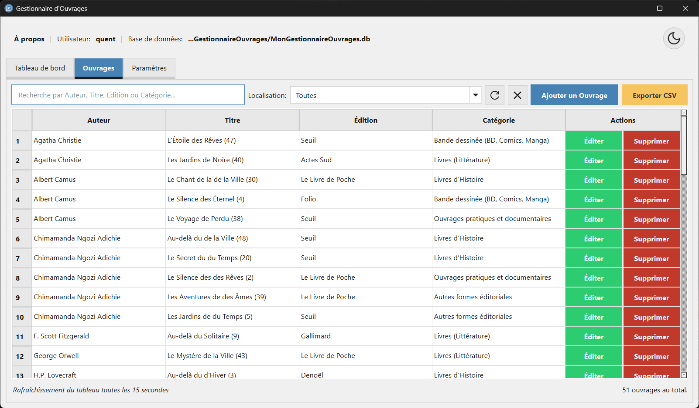
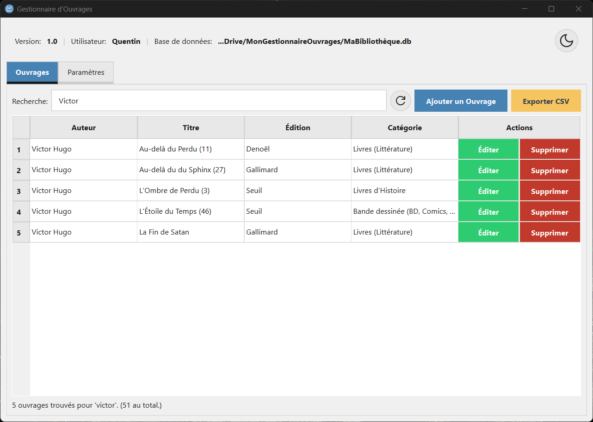
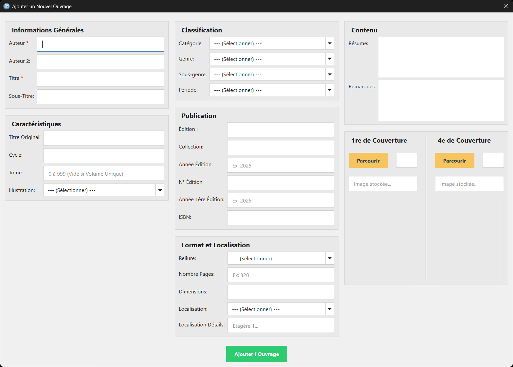
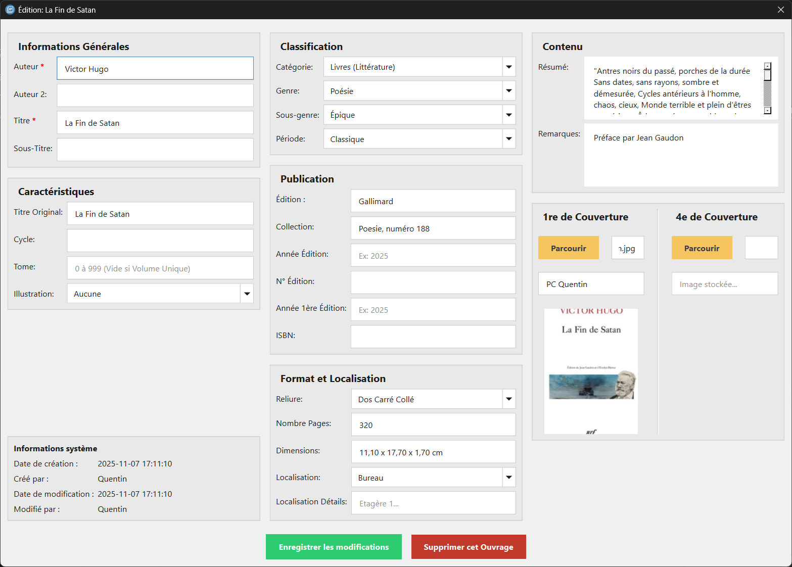
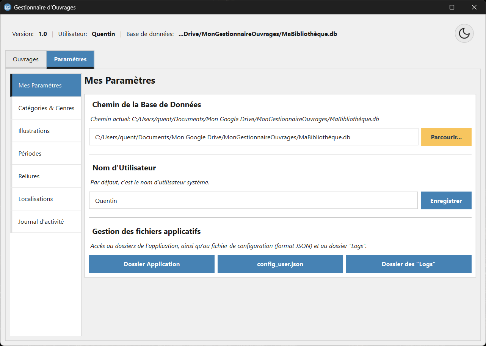
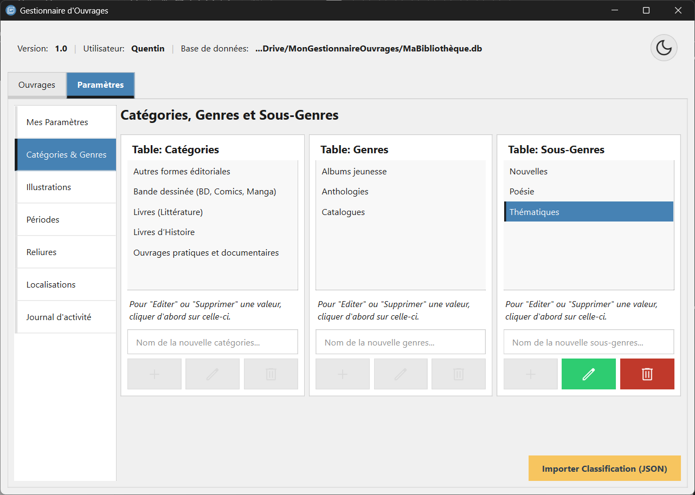
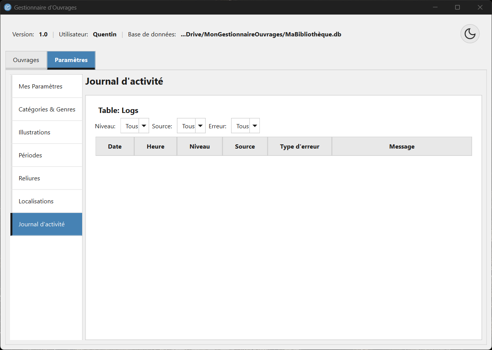

# Gestionnaire d'Ouvrages

- Application de gestion et de recherche d’ouvrages développée en **Python**, **PyQt6** et **SQLite3**
- Elle permet de consulter, d’ajouter, d'éditer, de supprimer, de rechercher et d'exporter des ouvrages dans une interface moderne et intuitive
- Enfin, la gestion des valeurs des listes déroulantes ainsi que de la configuration de l'utilisateur sont dans un espace dédié

## Table des matières

 1. [Fonctionnalités](#fonctionnalités)
 2. [Installation](#installation)
 3. [Bonus](#bonus)
 3. [Dépendances](#dépendances)
 4. [Aperçu](#aperçu)
 5. [Structure du projet](#structure-du-projet)
 6. [Licence](#licence)
 7. [Auteur](#auteur)


## Fonctionnalités

- **Base de données** initialisée dès le premier lancement de l'application (possibilité d'ouvrir un fichier, au format .db, existant)
- **Recherche rapide** d’ouvrages par auteur, titre, édition et catégorie
- **Ajout** et **Édition** d’ouvrages avec un formulaire dédié
- **Édition** et **suppression** d’ouvrages directement à travers la liste des ouvrages
- **Export** des ouvrages, au format CSV, pour un usage externe
- **Import** de la classification des ouvrages, via un fichier JSON
- **Thème clair/sombre** avec toggle intégré
- **Configuration de l'utilisateur** stockée dans un fichier dédié (comprenant le chemin de la base de données, le thème sélectionné et le nom de l'utilisateur)
- **Journal d'activité** et **Logs** sont présents afin de permettre à chaque utilisateur d'identifier les erreurs potentielles rencontrées

## Installation

1. [Télécharger la dernière version](https://github.com/TiercelinQ/gestionnaire-ouvrages/releases/download/v1.0.0/GestionnaireOuvrages.zip)
2. Dézipper le fichier zip au sein de votre poste de travail
3. Ouvrir le dossier **GestionnaireOuvrages**
4. Executer le fichier **GestionnaireOuvrages** (extension .exe) situé dans le dossier

> [!WARNING]
> - L'application doit être exécuter directement au sein du dossier **GestionnaireOuvrages**
> - N'hésitez pas à créer un raccourcis sur votre bureau ou à épingler l'application dans votre menu "Démarrer" pour faciliter son accès

### Bonus
- Vous pouvez télécharger une base de classification d'ouvrages (Catégories, Genres et Sous-Genres) pour votre gestionnaire à ce lien: [Classification JSON](https://github.com/TiercelinQ/gestionnaire-ouvrages/blob/main/assets/modeles/classification_cats-genres-subgenres.json)
- Ce fichier JSON est à importer via le bouton dédié au sein de l'onglet "Paramètres", menu "Catégories & Genres".

## Dépendances

- Python 3.13.9
- PyQt6
- SQlite3

## Aperçu

<p align="center">
    
    
</p>
<p align="center">
    
    
</p>
<p align="center">
    
    
</p>
<p align="center">
    
</p>

## Structure du projet

```plaintext
├── app
│   ├── config_manager.py
│   ├── data_models.py
│   ├── db
│   │   ├── db_export.py
│   │   ├── db_import.py
│   │   ├── db_init_data.py
│   │   ├── db_init_db.py
│   │   ├── db_lists.py
│   │   ├── db_logs.py
│   │   ├── db_ouvrages.py
│   │   └── db_users.py
│   ├── db_manager.py
│   ├── header_widget.py
│   ├── log
│   │   └── init_logging.py
│   ├── main_app.py
│   ├── ouvrage_add_modal.py
│   ├── ouvrage_edit_modal.py
│   ├── ouvrage_form_common.py
│   ├── parameters
│   │   ├── hierarchy_management_widget.py
│   │   ├── list_management_widget.py
│   │   ├── log_viewer_widget.py
│   │   └── user_settings_widget.py
│   ├── parameters_widget.py
│   ├── search_ouvrage_widget.py
│   ├── ui_manager.py
│   └── utils.py
├── assets
│   ├── captures
│   │   ├── 1_main.png
│   │   ├── 2_search.png
│   │   ├── 3_add.png
│   │   ├── 4_edit.png
│   │   ├── 5_settings-1.png
│   │   ├── 5_settings-2.png
│   │   └── 5_settings-3.png
│   └── modeles
│       └── classification_cats-genres-subgenres.json
├── resources
│   ├── icons
│   │   ├── add_white.svg
│   │   ├── app
│   │   │   ├── iconBookInventoryApp.ico
│   │   │   └── iconBookInventoryApp.png
│   │   ├── arrow_down_black.svg
│   │   ├── arrow_down_white.svg
│   │   ├── delete_white.svg
│   │   ├── edit_white.svg
│   │   ├── error.png
│   │   ├── information.png
│   │   ├── moon.svg
│   │   ├── question.png
│   │   ├── refresh_black.svg
│   │   ├── refresh_white.svg
│   │   ├── success.png
│   │   ├── sun.svg
│   │   └── warning.png
│   └── styles
│       ├── dark_theme.qss
│       └── light_theme.qss
├── resources.qrc
├── resources_rc.py
└── run.py
```

## Licence

- Aucune licence n’est associée à ce projet pour le moment.
- L’utilisation, la modification et la redistribution du code ne sont pas autorisées sans l’accord explicite de l’auteur.

## Auteur

Développé par Quentin Tiercelin
